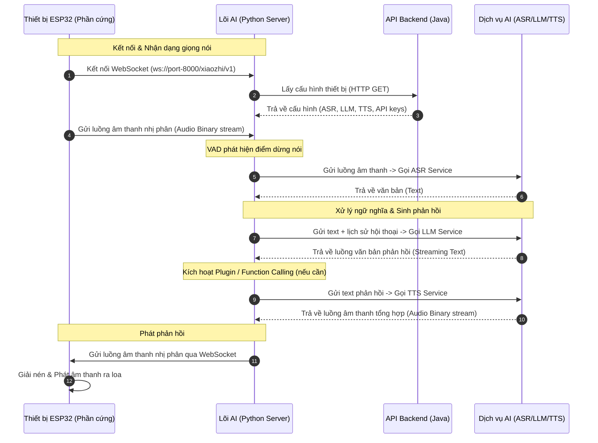

# Tài liệu Kỹ thuật: Hệ thống Voice AL Studio (`xiaozhi-esp32-server`)

Hệ thống **Voice AL Studio** là giải pháp Backend & Frontend toàn diện kết nối phần cứng thông minh (ESP32) với các dịch vụ AI để thực hiện hội thoại giọng nói thời gian thực (Real-time Voice Chat), điều khiển thiết bị IoT, cùng bảng quản trị trực quan trên cả Web và Mobile.

Dự án được thiết kế theo mô hình **tách biệt giao diện và nghiệp vụ, tách biệt phần lõi xử lý AI thời gian thực và phần quản trị doanh nghiệp**.

---

## 1. Kiến trúc Tổng thể & Phân rã Component

Hệ thống được chia làm 5 phân hệ (components) hoạt động phối hợp thông qua các giao thức mạng tiêu chuẩn:

```
voiceAL (Workspace Root)
  ├── main/xiaozhi-server  : Lõi xử lý AI thời gian thực (Python) - Port 8000
  ├── main/manager-api     : API Backend Quản trị & Đồng bộ (Java Spring Boot) - Port 8002
  ├── main/manager-web     : Bảng điều khiển Web dành cho Admin (Vue.js 2) - Port 8001
  ├── main/manager-mobile  : Ứng dụng di động quản trị (uni-app + Vue 3) - Chạy trên iOS/Android/WeChat
  └── digital-human        : Phân hệ thử nghiệm Nhân vật số & Wake Word local (Python + Web)
```

### 1.1. Thiết bị Phần cứng (ESP32 Client)
* **Nhiệm vụ:**
  * Thu âm giọng nói của người dùng thông qua microphone.
  * Truyền luồng dữ liệu âm thanh dạng nhị phân (PCM/Opus) qua WebSocket tới Python AI Server.
  * Nhận luồng âm thanh phản hồi từ AI Server và phát ra loa thời gian thực.
  * Nhận lệnh điều khiển thiết bị ngoại vi (đèn, cảm biến...) từ server để thực thi cục bộ.

### 1.2. Lõi xử lý AI thời gian thực (`xiaozhi-server` - Python)
* **Nhiệm vụ:**
  * Thiết lập kết nối **WebSocket hai chiều, độ trễ cực thấp** với phần cứng ESP32.
  * Phân đoạn giọng nói bằng công nghệ **VAD (Voice Activity Detection)** để phát hiện điểm bắt đầu/kết thúc câu nói.
  * Tích hợp các bộ chuyển đổi giọng nói thành văn bản (**ASR** - FunASR/SenseVoice/Whisper) và văn bản thành giọng nói (**TTS** - EdgeTTS/CosyVoice/OpenAI).
  * Gọi các mô hình ngôn ngữ lớn (**LLM** - Gemini, ChatGPT, Ollama, DeepSeek) để hiểu ý định và sinh câu trả lời.
  * Quản lý ngữ cảnh và lịch sử hội thoại (Memory).
  * Cung cấp **hệ thống Plugin** giúp LLM gọi hàm (Function Calling) điều khiển thiết bị IoT (ví dụ kết nối Home Assistant).
  * Tự động kéo cấu hình hoạt động (chọn nhà cung cấp AI, API key...) từ Java Backend khi khởi chạy hoặc cập nhật.

### 1.3. Backend Quản trị (`manager-api` - Java Spring Boot)
* **Nhiệm vụ:**
  * Cung cấp RESTful API bảo mật cho Frontend Web/Mobile truy cập.
  * Quản lý tài khoản, phân quyền quản trị viên (RBAC), bảo mật phiên làm việc.
  * Đăng ký thiết bị ESP32, lưu trữ cấu hình riêng của từng thiết bị.
  * Lưu trữ cấu hình toàn hệ thống vào database MySQL (các API Key AI, cấu hình giọng nói TTS, cấu hình kết nối).
  * Lưu trữ file firmware và điều phối quá trình cập nhật phần mềm từ xa (**OTA - Over-The-Air**) cho ESP32.
  * Sử dụng **Redis** làm bộ nhớ đệm cache tốc độ cao cho các thông tin tần suất truy cập lớn (heartbeat thiết bị, mã xác thực SMS, cache cấu hình Model).

### 1.4. Frontend Web (`manager-web` - Vue.js 2)
* **Nhiệm vụ:**
  * Cung cấp giao diện trực quan (Dashboard) cho Admin quản trị hệ thống.
  * Cấu hình linh hoạt việc đổi nhà cung cấp dịch vụ AI (ASR, LLM, TTS), nhập API keys.
  * Quản lý danh sách thiết bị, phân quyền người dùng, cấu hình nhân vật (Prompts, giọng nói mẫu).
  * Quản lý cập nhật OTA cho thiết bị.

### 1.5. Mobile App (`manager-mobile` - uni-app)
* **Nhiệm vụ:**
  * Mang toàn bộ tính năng quản trị thiết bị, người dùng và cấu hình AI lên giao diện di động (iOS/Android/WeChat Mini Program).

---

## 2. Ngăn Công nghệ Chi tiết (Technology Stack)

| Thành phần | Công nghệ / Thư viện chính | Mô tả vai trò |
| :--- | :--- | :--- |
| **Lõi AI (Python)** | Python 3.10+, Asyncio, WebSockets, aiohttp/httpx | Xử lý bất đồng bộ kết nối IoT, gọi API dịch vụ AI đồng thời không gây nghẽn. |
| | SileroVAD (Local) | Bộ phát hiện giọng nói hoạt động trực tiếp trên server để cắt nhỏ âm thanh. |
| | Sherpa-ONNX, FunASR, SenseVoice | Công cụ nhận dạng giọng nói cục bộ (Offline ASR) hiệu năng cao. |
| | Edge-TTS, CosyVoice, FishSpeech | Tổng hợp giọng nói tự nhiên, nhân bản giọng nói (TTS). |
| **Backend (Java)** | Java 21, Spring Boot 3, Spring MVC | Khung phát triển ứng dụng chính, API nghiệp vụ. |
| | MyBatis-Plus, Druid, MySQL | Quản trị cơ sở dữ liệu quan hệ, kết nối DB hiệu năng cao. |
| | Liquibase | Tự động migrate và đồng bộ cấu trúc bảng database theo phiên bản. |
| | Redis (Spring Data Redis) | Cache trạng thái online thiết bị, mã OTP, chặn spam SMS. |
| | Apache Shiro | Hệ thống phân quyền RBAC (Role-Based Access Control) bảo mật API. |
| **Web Frontend** | Vue.js 2, Webpack, Element UI | Framework phát triển SPA, thư viện giao diện chuẩn tối ưu tối. |
| | Flyio / Axios | Gửi request HTTP không đồng bộ lên backend Java. |
| | CryptoJS / SM2 Cryptography | Thư viện mã hóa mật khẩu phía client trước khi truyền tải. |
| **Mobile Frontend**| uni-app v3, Vue 3, Vite, TypeScript, Pinia, UnoCSS | Framework phát triển đa nền tảng, biên dịch ra Native App và Mini Program. |

---

## 3. Luồng Dữ liệu & Cơ chế Giao tiếp Chi tiết

Hệ thống sử dụng đồng thời hai cơ chế giao tiếp chính tùy thuộc vào tính chất luồng dữ liệu:

### 3.1. Luồng thoại thời gian thực (Real-time Audio Flow via WebSocket)



1. **Kết nối & Xác thực ban đầu:**
   * Thiết bị ESP32 mở kết nối WebSocket đến `xiaozhi-server` (Port 8000). 
   * `xiaozhi-server` tạo một instance `ConnectionHandler` riêng biệt để cô lập phiên làm việc của thiết bị này. Nó sẽ gọi API sang Java Backend để lấy thông số cấu hình riêng (API key, Model sử dụng) được lưu trong DB.
2. **Thu âm & Cắt âm (Uplink Audio & VAD):**
   * Người dùng nhấn nút nói hoặc gọi từ khóa đánh thức (Wake Word). ESP32 nén âm thanh (PCM/Opus) và gửi liên tục các chunk dữ liệu nhị phân qua WebSocket.
   * `receiveAudioHandle.py` nhận âm thanh, nạp vào thư viện **Silero VAD** để phân tích trạng thái giọng nói. Khi phát hiện người dùng dừng nói (silence vượt ngưỡng), luồng thu âm được ngắt và chuyển sang bước dịch.
3. **Dịch giọng nói (ASR):**
   * Khối âm thanh thu được gửi đến bộ dịch **ASR**. Dịch vụ ASR (địa phương FunASR hoặc đám mây) trả về nội dung chuỗi văn bản (Text).
4. **Suy nghĩ & Gọi lệnh (LLM & Function Calling):**
   * Văn bản kết quả kết hợp với lịch sử hội thoại được nạp vào mô hình **LLM**.
   * Nếu người dùng yêu cầu lệnh đặc biệt (ví dụ: *"Bật đèn phòng khách"*), LLM sẽ trả về yêu cầu gọi hàm dạng JSON. `functionHandler.py` thực thi hàm này (gọi API điều khiển của Home Assistant), lấy kết quả phản hồi lại cho LLM để sinh câu trả lời tự nhiên.
5. **Tổng hợp tiếng nói & Phát âm (TTS & Downlink Audio):**
   * Văn bản trả về từ LLM được chuyển trực tiếp vào bộ **TTS** để sinh file âm thanh.
   * `sendAudioHandle.py` truyền luồng âm thanh nhị phân này qua WebSocket ngược lại cho ESP32. ESP32 nhận được chunk nào sẽ phát ngay lập tức chunk đó ra loa (Streaming audio playback) nhằm tối thiểu hóa thời gian chờ đợi của người dùng.
6. **Ngắt hội thoại (Interruption Handling):**
   * Trong lúc server đang gửi âm thanh phát đáp, nếu người dùng bấm nút ngắt hoặc microphone phát hiện giọng nói mới, ESP32 sẽ gửi tín hiệu ngắt (`abort`). Server ngay lập tức dừng chạy TTS và LLM để chuyển sang trạng thái nghe lượt hội thoại mới.

### 3.2. Luồng quản trị & Đồng bộ cấu hình (Management REST Flow)

* **Giao tiếp Frontend - Backend:** `manager-web` và `manager-mobile` giao tiếp với `manager-api` (Port 8002) qua các API HTTP/HTTPS dạng RESTful truyền nhận dữ liệu định dạng JSON.
* **Xác thực phiên làm việc:** Apache Shiro tại Java Backend chặn và kiểm tra token của mọi request. Nếu hợp lệ, hệ thống mới thực thi ghi/đọc dữ liệu.
* **Bộ đệm Redis:** Các thao tác đọc cấu hình tĩnh, danh sách thiết bị hoạt động liên tục được Java lưu tạm vào Redis để giảm thiểu số lượng câu lệnh `SELECT` trực tiếp xuống MySQL DB, nâng cao tốc độ tải trang.
* **Đồng bộ tự động sang Lõi AI (Python Server):** Mỗi khi cấu hình được thay đổi trên giao diện Web Admin, Java API sẽ cập nhật database MySQL và xóa cache Redis tương ứng. Python server khi nhận cuộc gọi mới hoặc khởi động sẽ kéo cấu hình mới qua HTTP Client để đảm bảo thông tin luôn đồng bộ mà không cần restart service Python.

---

## 4. Cơ chế Bảo mật & Mã hóa dữ liệu chuyên sâu

Để đảm bảo an toàn thông tin khi triển khai thương mại, hệ thống áp dụng các lớp bảo mật nâng cao sau:

### 4.1. Mã hóa mật khẩu một chiều phi đối xứng SM2 (Quốc gia Trung Quốc / Tiêu chuẩn bảo mật mới)
* **Vấn đề:** Khi người dùng nhập mật khẩu trên trình duyệt, nếu gửi dạng text thô hoặc chỉ mã hóa MD5/SHA đơn giản sẽ dễ bị tấn công nghe lén (Man-in-the-middle) hoặc tấn công từ điển.
* **Giải pháp SM2:**
  * Khi Java backend khởi chạy, hệ thống kiểm tra và tự động tạo cặp khóa bảo mật SM2 gồm khóa công khai (Public Key) và khóa bí mật (Private Key) lưu trong bảng `sys_params` DB (nếu chưa có).
  * Frontend Web (`login.vue`) khi tải trang đăng nhập sẽ gọi API `/user/pub-config` để lấy khóa công khai SM2.
  * Khi bấm "Đăng nhập", mật khẩu của người dùng được mã hóa bằng thuật toán SM2 ngay dưới trình duyệt thành một chuỗi Hex bảo mật cao trước khi gửi qua Internet.
  * Java Backend nhận được mật khẩu mã hóa sẽ dùng khóa bí mật SM2 để giải mã và kiểm tra độ chính xác. Bằng cách này, mật khẩu thực tế **không bao giờ truyền đi dưới dạng bản rõ trên mạng**.

### 4.2. Đăng nhập liên kết bảo mật (Google OAuth)
* Hệ thống tích hợp **Google Identity Services (GIS)** cho phép người dùng click "Tiếp tục đăng nhập bằng Google".
* Trình duyệt giao tiếp trực tiếp với máy chủ Google để lấy mã xác thực bảo mật (ID Token/Credential), sau đó gửi mã này lên `/user/google-login` Java Backend. 
* Backend Java giải mã ID Token để lấy thông tin Email, tự động tạo tài khoản hoặc đăng nhập trực tiếp mà không cần lưu trữ mật khẩu của Google.

### 4.3. Quản lý biến môi trường an toàn qua `.env` (Chống lộ lọt Secrets)
* Các khóa bảo mật nhạy cảm của Google OAuth (`google.clientId` và `google.clientSecret`) **không bao giờ được hardcode (ghi chết) vào cơ sở dữ liệu migration SQL** để tránh bị đẩy lên GitHub/GitLab công khai (Bị chặn bởi cơ chế GitHub Push Protection).
* **Giải pháp lưu trữ cục bộ (Local Dotenv Sync):**
  1. Các thông số nhạy cảm được cấu hình cục bộ trong file `main/.env`:
     ```env
     CLIENT_ID=YOUR_GOOGLE_CLIENT_ID
     CLIENT_SECRET=YOUR_GOOGLE_CLIENT_SECRET
     ```
  2. File `docker-compose.yml` nạp file `.env` này thông qua directive `env_file`:
     ```yaml
     xiaozhi-esp32-server-web:
       env_file:
         - ../.env
     ```
  3. Lớp khởi tạo của Java backend (`SysParamsServiceImpl.java`) khi khởi chạy sẽ tự động đọc các biến môi trường này từ container (`System.getenv("CLIENT_ID")`) và **đồng bộ trực tiếp (Upsert) vào cơ sở dữ liệu local** để sử dụng. Lịch sử commit Git hoàn toàn sạch và an toàn!
